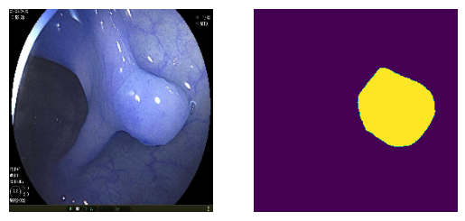

## Unzip data

```bash
unzip bkai-igh-neopolyp.zip -d data/
```

## Training

```bash
python -m neopolyp.train -bs 8 -me 200 -nw 4 -l 0.0001 -sr 0.96\
        -d /kaggle/input/bkai-igh/bkai-igh-neopolyp \
        -w -wk [YOUR_WANDB_KEY]
```

## Testing

```bash
python -m neopolyp.infer --model [CHECKPOINT_PATH] --data_path [DATA_PATH] --save_path [SAVE_PATH]
```
